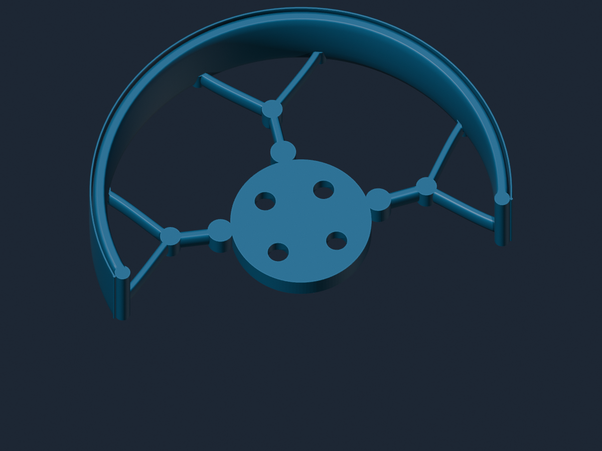
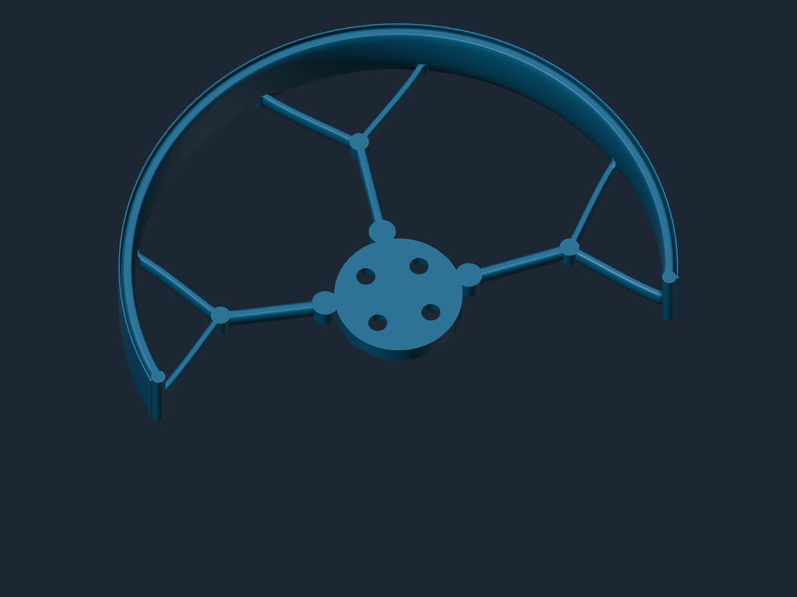
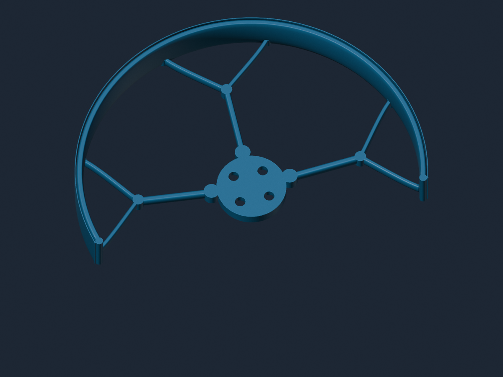
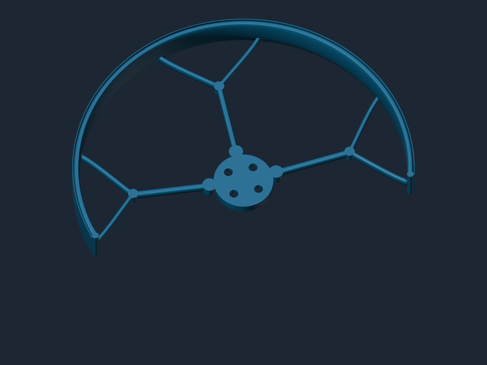
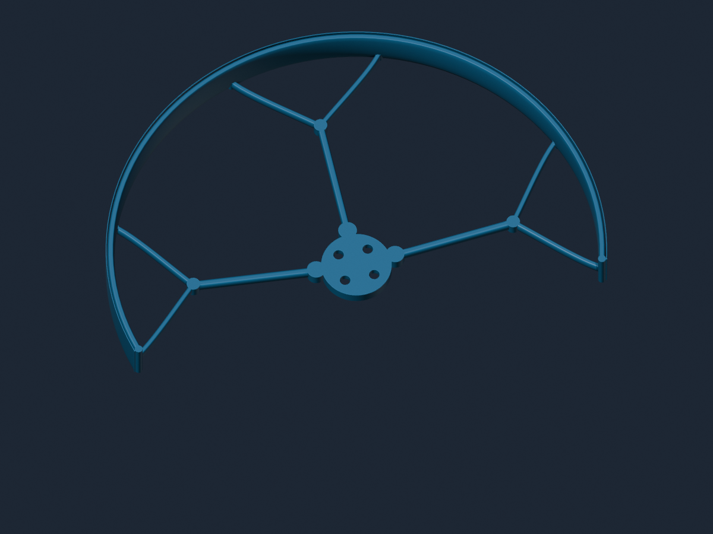

# Parametric Biomimetic Propeller Guard

A configurable open-arc propeller guard for 2–5 inch quadcopter propellers, designed for flat, support-free printing in hard TPU. The Blender Geometry Nodes model includes organic forked reinforcement, adjustable protection coverage, nozzle-aware minimum features, a wear lip, and four real motor-mount layouts.

**Creator:** Inouk T. — **Contact:** inoukt1@gmail.com

## Main features

- Propeller presets: 2, 2.5, 3, 3.5, 4, and 5 inches.
- Open protector arc: 180–210 degrees.
- Motor layouts: diameter 9 mm, diameter 12 mm, 16x16 mm, and 16x19 mm.
- Presets for BETAFPV 1105 and BETAFPV 1505 examples.
- Fixed 3.0 mm through holes with 4.5 mm lower recesses.
- Adjustable strength, branch reinforcement, bumper profile, clearance, height, nozzle size, and outer wear bead.
- Geometry validation for hole centers, chamfers, connectivity, manifold edges, dimensions, and parameter limits.

## Quick start

1. Open `Parametric_Biomimetic_Propeller_Guard.blend`.
2. Select `halfApexPropGuardModify.001`.
3. Open the Geometry Nodes modifier named `PG Biomimetic Guard V2`.
4. Choose the propeller diameter and motor mount before changing strength or print-speed options.
5. Export the selected evaluated object as STL with modifiers applied.
6. Slice it flat with the motor plate and branch bottoms on the build plate.

Your current 1505 layout is `Motor Example Preset = 2`, or `Motor Example Preset = 0` with `Motor Mount Pattern = 1`.

## Size gallery

All images use the 1505 diameter-12-mm motor layout and balanced guard settings.

| 2 inch | 2.5 inch |
|---|---|
|  |  |
| **3 inch** | **3.5 inch** |
|  |  |
| **4 inch** | **5 inch** |
|  |  |

## Documentation

- [Usage guide](docs/USAGE.md)
- [Parameter and motor reference](docs/PARAMETER_REFERENCE.md)
- [Printing guide](docs/PRINTING.md)
- [Developer guide](docs/DEVELOPMENT.md)
- [Thingiverse listing copy and upload checklist](docs/THINGIVERSE.md)
- [Release history](CHANGELOG.md)
- [Licenses](LICENSE.md)

## Safety

This is an experimental printable guard, not certified safety equipment. Verify motor-hole measurements, screw length, blade clearance, mesh integrity, and print quality before powering the aircraft. Hand-rotate the propeller with the battery disconnected and replace the guard after cracks, permanent deformation, loose layers, or hard impacts.

## License

The model and documentation are licensed under CC BY 4.0. The Python generator is licensed under MIT. Credit **Inouk T.** and indicate modifications. See [LICENSE.md](LICENSE.md).
